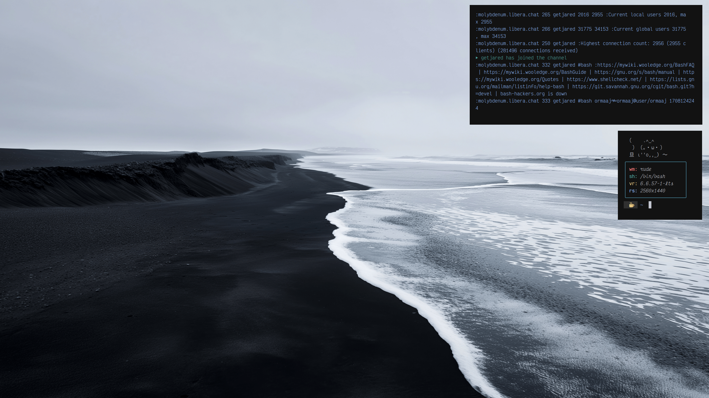

<div align="center">

## ｒｕｄｅ
**[ a x11 tiling/floating wm ]**

[](http://unlicense.org/)
[](https://en.wikipedia.org/wiki/C_(programming_language))
</div>

## ✧ preview
<p align="center">
    
</p>

## ✧ features
- 🪟 tiling and floating
- 🔄 persistent window positions in float
- 🖥️ virtual desktops
- ⚡ lightweight and fast
- 🎯 minimal dependencies

## ✧ installation
```bash
git clone https://github.com/getjared/rude.git
cd rude
make
sudo make install
```

## ✧ dependencies
- 📝 c compiler (gcc or clang)
- 🔧 make
- 🖥️ x11 libraries and headers (xlib)

## ✧ usage
### key bindings
| key | action |
|-----|--------|
| `mod4 + space` | toggle between tile/float modes |
| `mod4 + q` | kill focused window |
| `mod4 + tab` | cycle through windows |
| `mod4 + (1-5)` | switch to desktop 1-5 |
| `mod4 + mouse1` | move window (float mode) |
| `mod4 + mouse3` | resize window (float mode) |

### starting rude
add to your `~/.xinitrc`:
```bash
exec rude
```
then:
```bash
startx
```

## ✧ configuration
rude follows the suckless philosophy - configuration is done in code.
1. modify source code
2. recompile
3. reinstall

### recommended tools
- `sxhkd` for additional keybindings
- `dmenu` for launching programs
- `st` for terminal emulation

## ✧ inspiration
crafted from scratch with inspiration from:
- sowm
- dwm

<div align="center">

```ascii
╭─────────────────────────╮
│  made with ♥ by jared   │
╰─────────────────────────╯
```
</div>
